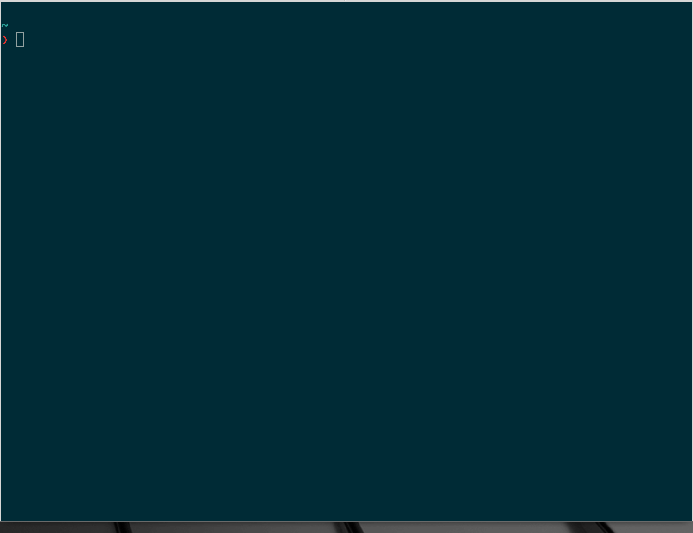

# jump-kun
Directory jumper made by Rust

## Why jump-kun?

Can you count how many times did you typed ```cd``` on your teminal?

Typing..

```cd \where\you\wanna\go ```

everytime is cumbersome.

Just use jump-kun.



jump-kun...

- Automatically records dirs you visited and shows.
- Lists parents and child dirs of current dirs


(This crate is heavyly inspired by [b4b4r07's enhancd](https://github.com/b4b4r07/enhancd))

# How to install

## Run cargo install

```cargo install jump-kun```

### (or clone this repo then...) 
```cargo install --path .```


## Add following script to your .zshrc

(Might work on fish or bash, but not sure...)

```
function jump-kun-jump(){
    local selected=$(jump-kun)
    if [[ -n $selected ]]; then
        \cd $selected
    fi
}
```

Then type ``` jump-kun-jump ``` on your terminal.

## WindowsOS

Sorry Windows users. jump-kun is not supported on WindowsOS.  
jump-kun uses skim as a user interface and skim is dependent on tuikit.  

Since tuikit is not supported on Windows, I can't guarantee that my library works on Windows.  
[Issue](https://github.com/TakaakiFuruse/jump-kun/issues/18)
